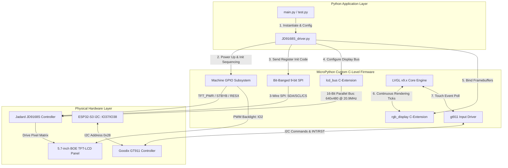

# Optimized MicroPython Display Driver & Custom Firmware for Jadard JD9168S (ESP32-S3)

[](https://micropython.org)
[](https://lvgl.io)
[](https://www.espressif.com/en/products/socs/esp32-s3)
[](https://opensource.org/licenses/MIT)

An industry-grade hardware driver and custom MicroPython system-level implementation designed to interface the **ESP32-S3 (Octal PSRAM variant)** with the **5.7" BOE TFT-LCD display (CDTECH S057BWV02NP-FC01)** via the **Jadard JD9168S controller** (running at 640x480 RGB565) and the **Goodix GT911 capacitive touch screen**.

To circumvent Python interpreter performance bottlenecks and achieve 60+ FPS animations (ideal for SquareLine Studio UI deployments), this project integrates a custom-compiled MicroPython firmware with core display rendering and touch systems built directly into the C-level subsystem.

---

## System Architecture

The following diagram illustrates the hybrid control model and multi-layered rendering pipeline developed for this system:



---

## Key Technical Features

* **C-Compiled Graphics Subsystem**: Features a custom ESP32-S3 firmware image with **LVGL v9**, **lcd_bus**, **rgb_display**, and the **GT911** touch input driver baked directly into the MicroPython C kernel for native speed graphics processing.
* **Octal PSRAM Double-Buffering**: Allocates two hardware-level 16-bit RGB565 framebuffers (614,400 bytes each, ~1.2 MB total allocation) directly inside the ESP32-S3's high-speed Octal PSRAM. This guarantees smooth page flips and completely eliminates screen-tearing/shearing artifacts.
* **Hybrid Control Topology**:
  * **3-Wire Bit-Banged SPI (9-bit words)**: Transmits the initial 27 hardware configuration commands to prepare the JD9168S register state. The 9-bit word structure uses the first bit as the DCX flag (0 = command, 1 = data) to bypass the controller's lack of a physical Data/Command (D/C) pin.
  * **16-Bit Parallel RGB Interface**: Hands off high-speed rendering to the ESP32-S3's RGB parallel DMA peripheral (running at 20.92 MHz pixel clock) with dedicated HSYNC, VSYNC, and DE signals.
* **Automated Hardware Power-Up Sequence**: Implements a strict millisecond-level power sequence matching the LCD panel's power-down/power-up requirements (regulating LP3100 dual rail converters, exiting standby mode, and executing hardware reset pulses) to protect physical display components from power-spike damage.
* **Integrated Touch Processing**: Fully configures the GT911 capacitive controller over I2C (address `0x28`), handles coordinate system mapping, and binds the controller to the LVGL active input device engine automatically.

---

## Hardware Specifications

| Component | Target Hardware Specification | Role in System |
| :--- | :--- | :--- |
| **Microcontroller** | ESP32-S3 (Octal PSRAM, min. 8MB flash / 8MB PSRAM) | Main application processor and graphics renderer |
| **LCD Panel** | 5.7" BOE TFT-LCD (CDTECH S057BWV02NP-FC01) | Physical display panel |
| **Display Controller** | Jadard JD9168S | Handles timing, register initialization, and display drive |
| **Touch Controller** | Goodix GT911 (Capacitive, I2C interface) | Intercepts multitouch finger coordinates |
| **Power Converter** | LP3100 Power Management IC | Generates dual high-voltage rails: AVDD (+5.5V) and AVEE (-5.5V) |

---

## System Pinout & Wiring Configuration

### 1. RGB Parallel Bus (16-bit Data + Timings)
| Signal Name | ESP32-S3 GPIO | Description |
| :--- | :---: | :--- |
| **HSYNC** | GPIO 39 | Horizontal Synchronization pulse |
| **VSYNC** | GPIO 41 | Vertical Synchronization pulse |
| **DE** | GPIO 40 | Data Enable (high when active pixels are sent) |
| **PCLK** | GPIO 42 | Pixel Clock (20.92 MHz rendering clock) |
| **B0 - B4** | 8, 3, 46, 9, 1 | Blue channel parallel data (5 bits) |
| **G0 - G5** | 5, 6, 7, 15, 16, 4 | Green channel parallel data (6 bits) |
| **R0 - R4** | 45, 48, 47, 21, 14 | Red channel parallel data (5 bits) |

### 2. 3-Wire SPI (Register Init Only)
| Signal Name | ESP32-S3 GPIO | Description |
| :--- | :---: | :--- |
| **SPI_SDA** | GPIO 17 | Serial Data (transmits 9-bit commands) |
| **SPI_SCL** | GPIO 18 | Serial Clock |
| **SPI_CS** | GPIO 10 | Chip Select (active LOW) |

### 3. Power, Backlight, & System Control
| Signal Name | ESP32-S3 GPIO | Active State | Description |
| :--- | :---: | :---: | :--- |
| **RESX** | GPIO 11 | LOW | Hardware reset pulse |
| **STBYB** | GPIO 12 | HIGH | Exits hardware standby mode |
| **TFT_PWR** | GPIO 13 | HIGH | Enables LP3100 (+5.5V / -5.5V rails) |
| **BACKLIGHT** | GPIO 2 | PWM | Backlight brightness controller (PWM dimming) |

### 4. Goodix GT911 Capacitive Touch
| Signal Name | ESP32-S3 GPIO | Active State | Description |
| :--- | :---: | :---: | :--- |
| **TOUCH_SDA** | GPIO 37 | — | I2C Data line (with external pull-ups) |
| **TOUCH_SCL** | GPIO 38 | — | I2C Clock line (with external pull-ups) |
| **TOUCH_INT** | GPIO 35 | — | Interrupt pin (pulled high to set I2C address `0x28`) |
| **TOUCH_RST** | GPIO 36 | LOW | Hardware reset pin |

---

## Installation & Deployment

### Step 1: Flash the Custom Firmware
Before launching the Python environment, you must flash the target ESP32-S3 with the pre-compiled C-level firmware binaries located in the `Firmware/` folder.

1. Install `esptool` on your computer:
   ```bash
   python -m pip install esptool
   ```
2. Connect your ESP32-S3 to your PC and identify its serial communications port (e.g. `COM6` on Windows, or `/dev/ttyACM0` on Linux/Mac).
3. Put the board into **Download Mode** (Hold the `BOOT` button down, press and release `RESET`, then release `BOOT`).
4. Erase the flash memory to prevent boot-loops caused by legacy partitions:
   ```bash
   python -m esptool --chip esp32s3 --port COMPORT erase_flash
   ```
   *(Replace `COMPORT` with your actual port identifier).*
5. Flash the custom binaries in a single transaction (run this command from the root of this repository):
   ```bash
   python -m esptool --chip esp32s3 --port COMPORT -b 460800 --before default_reset --after hard_reset write_flash --flash_mode dio --flash_size 8MB --flash_freq 80m 0x0 Firmware/bootloader.bin 0x8000 Firmware/partition-table.bin 0x10000 Firmware/micropython.bin
   ```
6. Disconnect the USB cable and reconnect it to execute a clean power-on reset.

### Step 2: Upload Driver & Tests to Microcontroller
1. Open your MicroPython IDE (Thonny, VS Code with MicroPython extension, or `mpremote`).
2. Establish a connection to the ESP32-S3 board. If the connection succeeds, the REPL banner will report:
   ```text
   LVGL MicroPython 1.x.x on ...; ESP32S3 module with Octal-SPIRAM
   ```
3. Upload both python files to the root directory `/` of the device:
   - `JD9168S_driver.py` (the display driver)
   - `test.py` (the showcase test script)

---

## Showcase Validation Script

To test the physical installation, load `test.py` in your IDE and run it. The hardware validation suite will execute four automated verification stages:

* **Stage 1 (Color Channel Alignment)**: Draws three large "Hello World" labels in **GREEN** (left-aligned), **RED** (centered), and **BLUE** (right-aligned) to confirm that the RGB channel signals are not swapped on the physical data lines.
* **Stage 2 (Countdown)**: Executes a 5-second tick overlay centered on the lower quadrant of the screen.
* **Stage 3 (Uniformity Sweep)**: Fills the screen in solid solid RED, then solid GREEN, and finally solid BLUE (for 2 seconds each) to verify framebuffer consistency and identify any dead pixels.
* **Stage 4 (Canvas Painting & Touch)**: Launches an infinite canvas drawing app. Tapping or dragging anywhere on the screen draws green circular marks beneath the finger coordinate. Pressing the red **CLEAR** button in the lower-right corner flushes the rendering buffer to wipe the canvas.

---

## Developer Reference & API Usage

To deploy a custom user interface, save your code as `main.py` (which runs automatically on boot) and instantiate the driver class at the top of the file:

```python
from JD9168S_driver import JD9168S_Display
import task_handler
import lvgl as lv

# 1. Initialize the display, PSRAM framebuffers, and the GT911 touch engine
display = JD9168S_Display(
    width=640, 
    height=480, 
    backlight_pin=2, 
    rgb565_byte_swap=True,
    enable_touch=True
)

# 2. Run the periodic task handler to orchestrate background drawing ticks
th = task_handler.TaskHandler()

# 3. Create your custom LVGL UI components
screen = lv.screen_active()
button = lv.button(screen)
button.set_size(200, 80)
button.center()

label = lv.label(button)
label.set_text("Hello World!")
label.center()
```

### Class API: `JD9168S_Display`

```python
display = JD9168S_Display(width=640, height=480, backlight_pin=2, rgb565_byte_swap=True, enable_touch=True)
```

#### Initialization Arguments:
* `width` *(int)*: Panel horizontal pixel resolution. Default `640`.
* `height` *(int)*: Panel vertical pixel resolution. Default `480`.
* `backlight_pin` *(int)*: ESP32-S3 GPIO mapped to the PWM driver of the backlight. Default `2`.
* `rgb565_byte_swap` *(bool)*: Controls endianness of color bytes. In some manufacturing batches, Red and Blue channels are swapped due to physical cabling order. Toggling this flag between `True` and `False` corrects this issue in software, completely avoiding physical pin rewiring. Default `True`.
* `enable_touch` *(bool)*: Enables the GT911 touch controller and registers it as an input device in the LVGL ecosystem. Default `True`.

#### Methods:
* `set_backlight(percentage)`: Sets backlight intensity between `0` (off) and `100` (max brightness). Falls back to digital on/off if the firmware doesn't support hardware PWM dimming.
* `debug_memory()`: Outputs system diagnostics showing free CPU RAM and remaining free Octal PSRAM. Excellent for auditing performance leaks.

---

## Deep Technical Insights: The "Soft-Reboot" Crash

When developing with RGB parallel bus displays in Thonny or VS Code, you may notice that executing a soft reboot (e.g. hitting Ctrl-D or clicking Stop/Restart) will crash the MCU or drop the USB connection.

### Root Cause Analysis:
During a software reset (soft reboot), the MicroPython VM clears the Python interpreter state and resets the CPU control registers. However, **soft reboots do not cycle power to the ESP32-S3 physical pins or the external JD9168S display controller**. 
Because power remains uninterrupted:
1. The ESP32-S3's hardware-level RGB parallel DMA peripheral continues to transmit clock signals (PCLK) and data frames.
2. The JD9168S display controller remains in active sync mode, expecting uninterrupted frame data.
3. When the newly-rebooted Python script executes the display constructor again, it attempts to re-allocate physical DMA buffers and reset the RGB peripheral while it is actively locked and running.
This triggers a physical hardware collision inside the ESP32-S3 memory bus, resulting in a CPU kernel panic and dropping the USB interface.

### Professional Remedy:
To run the script again during development, perform a **hard reset**:
* Physically unplug the USB cable for 2 seconds and plug it back in.
* Or press the physical `RST` tactile switch on the ESP32-S3 board.

*Note: Once the script is compiled and saved as `main.py` to run autonomously on battery or USB power (disconnected from active IDE debugging sessions), this issue does not occur, and the system runs stable indefinitely.*

---

## Troubleshooting Matrix

| Symptom | Probable Root Cause | Verification & Remedy |
| :--- | :--- | :--- |
| **Black screen (backlight remains unlit)** | 1. Backlight GPIO is mapped incorrectly.<br>2. Physical driver power rail is not enabled. | Verify that `backlight_pin` matches your physical layout (typically GPIO 2). Check if GPIO 13 goes HIGH to activate the LP3100 power supply. Using a multimeter, measure AVDD and AVEE voltages at the display ribbon—they must read +5.5V and -5.5V. |
| **Backlight is lit, but screen displays random pixel noise / static** | The 3-wire SPI initialization commands did not reach the Jadard JD9168S register table. | Double check your 3-wire SPI connections: `SDA=IO17`, `SCL=IO18`, `CS=IO10`, `RESX=IO11`, `STBYB=IO12`. Review terminal outputs; you must see `[JD9168S] Init sequence complete (27 commands sent)` during boot. |
| **Touch coordinates do not register, or boot log prints: "Touch init failed"** | The GT911 touch chip is unpowered or has missing bus pull-up resistors. | Ensure the GT911 is powered at 3.3V. Verify SDA/SCL pull-ups (typically 4.7kΩ to 3.3V) are present on the hardware carrier. Confirm GT911 wiring matches `SDA=IO37`, `SCL=IO38`, `INT=IO35`, `RST=IO36`. |
| **Red and Blue color channels appear reversed** | Panel manufacturing variants have altered byte-order configurations. | Construct the display class passing the byte-swap parameter: `display = JD9168S_Display(rgb565_byte_swap=False)`. This switches endianness in software and corrects the color space instantly. |
| **Board enters continuous boot-loop after flashing** | Flashing step skipped flash erasing. | Erase the board flash memory using `esptool erase_flash` and re-perform the full flashing operation starting from Step 1. |
